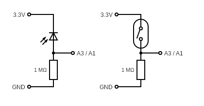
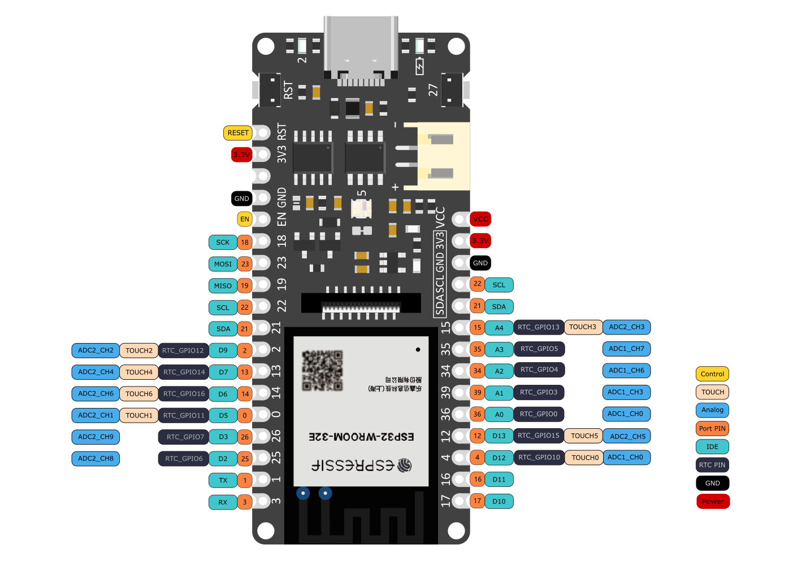
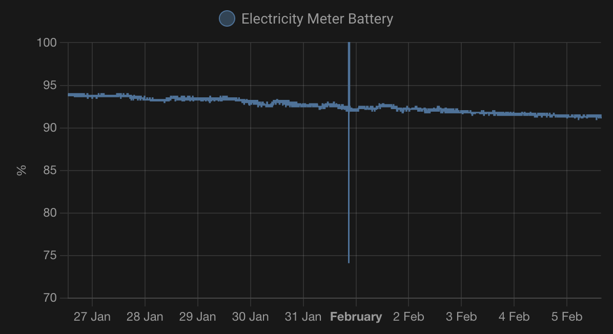
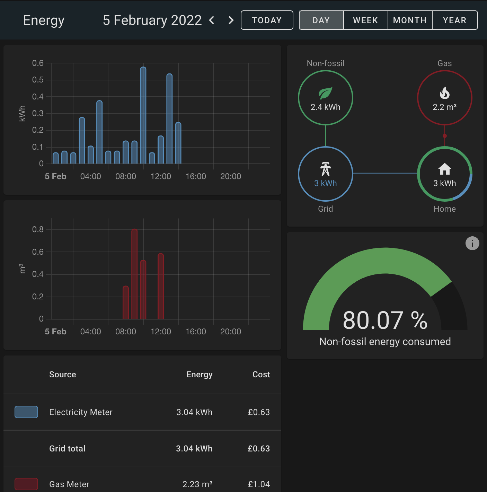

# Battery-Powered Utility Meter Usage Monitor

Do you have a "dumb" utility meter that you want to be able to track your usage
without replacing it? And do you want to run it from a battery? Then this
project is for you! (If you do have a power socket nearby then other projects e.g.
[Home Assistant Glow](https://github.com/klaasnicolaas/home-assistant-glow) are
more appropriate)

## Prerequisites

Your utility meter must either have an LED that pulses for each unit consumed,
or have a magnet in the dial that can be tracked with a reed switch.

IMAGE ELECTRICITY METER
IMAGE GAS METER

If your utility meter has 2 rates (e.g. Economy 7 electricity meter) then make
2 of the photodiode boards and use the `meter_2_rates` project, otherwise use
the `meter_1_rate` project.

You will also need an MQTT broker installed and (optionally) a Home Assistant
server.

## Hardware

- Low-power-capable ESP32 ([FireBeetle ESP32-E IoT Microcontroller](https://thepihut.com/products/firebeetle-esp32-e-iot-microcontroller-supports-wi-fi-bluetooth?variant=39493908168899))
- Dupont jumpers
- Photodiode or reed switch (depending on your meter type)
- 1 MOhm resistor (brown black green)
- [Vero/strip board](https://www.amazon.co.uk/gp/product/B08D2HP4B3/ref=ppx_yo_dt_b_asin_title_o06_s00?ie=UTF8&psc=1)
- [LiPo battery](https://www.amazon.co.uk/gp/product/B08214DJLJ/ref=ppx_yo_dt_b_asin_title_o00_s00?ie=UTF8&psc=1)
(1,000 - 2,000 mAh capacity should be plenty)
- USB C cable
- Blu Tack / electrical tape
- (Optional) Male header pins (if your ESP comes with soldered headers, you'll need 3 more pins)
- (Optional) USB power bank

## Tools

- Soldering iron
- Sharp knife (to cut low power trace)
- Side cutters (to trim resistor/photosensor leads)
- Tiny screwdriver (to fix battery connector)
- (Optional) 3D Printer
- (Optional) Breadboard (to help solder header pins)
- (Optional) Multi-meter (to assist positioning reed switch)

# Preparing Hardware

If your FireBeetle comes without headers pins, then solder them on. If you do not
have additional header pins, then break off a set of three pins before soldering,
making sure that the missing pins are furthest away from the USB port.

The easiest way to solder is to use a breadboard to hold the pins in place
while they are soldered.

Cut the "Low power" trace with a sharp knife. After doing this I measured the
deep sleep current to be about 14 uA.

[IMAGE TRACE]

## Sensors

The photodiode or reed switch can be connected to pin A3 (for the first sensor)
or pint A1 (if connecting a second sensor):



Cut the veroboard into a 3x3 square (11x11mm) with a sharp knife or old side cutters.

Solder the 3 header pins, the resistor and either the photodiode or the reed
switch to the board.

The photodiode should have its flat edge against the middle 3.3V pin.

Ensure the photodiode is on the opposite side of the board to the
header pins so that it can be positioned flush against the LED on the meter, or
that the reed switch has enough slack in the connecting wires to be easily
positioned in the correct place on the meter.

[IMAGE PHOTODIODE]

[IMAGE REEDSWITCH]

# Installing Software

Follow the [quickstart for ESP-IDF](https://docs.espressif.com/projects/esp-idf/en/latest/esp32/get-started/index.html)
to install the SDK and any dependencies.
Install [usb serial drivers](https://wiki.dfrobot.com/FireBeetle_Board_ESP32_E_SKU_DFR0654#target_11) (if necessary)

`. $HOME/esp/esp-idf/export.sh` (or where you installed the esp-idf SDK)

Clone this repository

`cd meter_1_rate` (if using one photodiode/reed switch)<br>
or<br>
`cd meter_2_rates` (if using 2 photodiodes)

`idf.py menuconfig`

Select "Meter Configuration":

- Enter the meter name, which is used as the MQTT topic prefix, e.g. `electricity` or `gas`
- WiFi network name (ssid)
- WiFi password
- MQTT broker URL
- Use Static IP: Un-checked
- Use Button debug: Checked

Connect the FireBeetle to the USB port of the computer.

```bash
idf.py build
idf.py -p /dev/cu.wchusbserial1410 flash # (replace the port with the correct one for your device)
idf.py monitor
```

## Set static IP

`idf.py menuconfig`

Select "Meter Configuration":

- Use Static IP: Checked
- Static IP address
- Gateway IP (IP address of your router)
- Netmask

```bash
idf.py build
idf.py -p /dev/cu.wchusbserial1410 flash # (replace the port with the correct one for your device)
idf.py monitor
```

## Test

Press the button marked with `27` (*not* the `RST` button) on the FireBeetle. The
green LED will flash, and log entries will appear in the console. Find out the IP address
assigned by looking for the log line starting `got ip:`, and configure your
router so that the device is given a static IP address. This will save a lot of
battery life by speeding up the WiFi connect process.

Using a program such as MQTT Explorer, you can verify that the pulse count is
being correctly published to `{meter_name}/total`, and the battery voltage to
`{meter_name}/battery`. (Ensure you are connected before pressing the button).

If the count isn't received by MQTT, the debug level can be increased to show more
information during the WiFi and MQTT connect process by changing the menuconfig:
"Component Config" > "Log Output" > "Default Log Verbosity": "Verbose"

## Install

Install the final version of the software.

`idf.py menuconfig`

Select "Meter Configuration":

- Use Button debug: Un-checked

```bash
idf.py build
idf.py -p /dev/cu.wchusbserial1410 flash # (replace the port with the correct one for your device)
```

## Battery

Before connecting the battery **double check the polarity of the connector**.
If the red wire does not line up with the `+` symbol on the board, then use a
tiny screwdriver to lift the tab to swap over the wires in the connector.

Connect the battery to the FireBeetle to charge it while connected via USB to
the computer. The red light will be solid while charging, and will flash
rapidly once charged. It should reach about 4.2V when fully charged. The
battery should have protection to not discharge below 2.5 V, but to play it
safe, this project is setup to report 0% battery and go into deep sleep when the
voltage is below 3 V.

[IMAGE battery]

## Home Assistant

Edit your Home Assistant `configuration.yaml` to setup MQTT sensors to receive the
meter values and battery voltage and percentage.

Replace ``"electricity"`` in the `state_topic` with the name you configured your
MQTT topic prefix to be.

```yaml
sensor:
  - platform: mqtt
    name: Electricity Meter
    unique_id: electricity_meter
    state_class: total_increasing
    device_class: energy
    state_topic: "electricity/total"
    unit_of_measurement: kWh
    value_template: "{{ value | float * 0.001 }}"
  - platform: mqtt
    name: Electricity Meter Battery Voltage
    unique_id: electricity_meter_battery_voltage
    device_class: voltage
    state_topic: "electricity/battery"
    unit_of_measurement: V
    value_template: "{{ value | float }}"
  - platform: mqtt
    name: Electricity Meter Battery
    unique_id: electricity_meter_battery
    device_class: battery
    unit_of_measurement: "%"
    state_topic: "electricity/battery"
    value_template: "{{ (([(value|float - 3), 1.2]|min / 1.2) * 100) | round(1) }}"
```

Restart Home Assistant for this to take effect.

# Case

3D Print the following files, depending on your setup:

- Case body
- Case insert (to separate the battery and the FireBeetle)
- Case lid for 1 sensor or Case lid for 2 sensors

and

- Photosensor body
- Photosensor lid

or

- Reedswitch body
- Reedswitch lid

# Connect sensor and install

Connect the photodiode or reed switch board to the FireBeetle, matching pins
3.3, GND and A3



[IMAGE SENSOR PINOUT]

[IMAGE CONNECTED BOARD]

If you're using a second sensor board, connect to the other 3.3, GND and A1 pins.

Install on the meter so the photodiode covers the LED or the reed switch is in the
correct position to be triggered by the magnet in the dial.

It can help in positioning the reed switch to attach a multi-meter in continuity
mode across the reed switch while the meter is turning.

[IMAGE CONNECTED TO METER]

## Recharging

You can monitor the battery percentage in Home Assistant, and when it gets low,
connect a USB power bank to the USB port on the FireBeetle to recharge. As
mentioned above, it will go into deep sleep if the voltage goes below 3 V.

Do not leave the battery connected but discharged below 3 V for a long time
because it could damage the battery.

Current battery consumption is 3% in 10 days using a 1,100 mAh battery, so the
it should last around a year before needing to be recharged.



# Monitor

Use the energy dashboard in Home Assistant to track your usage.



To track the cost of gas, convert the price per kWh to the price per m³ using
the conversion formula given on your gas bill.
